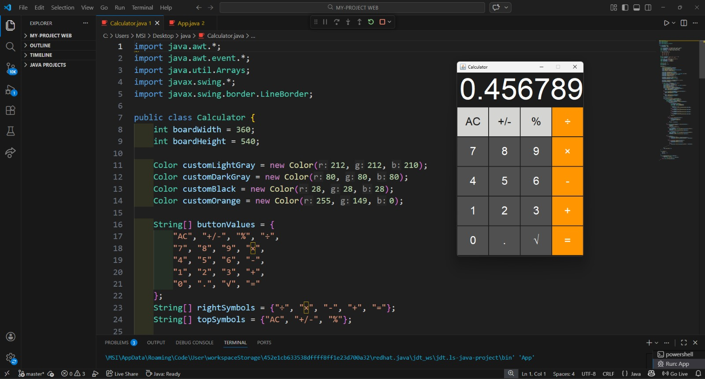

# 🧮 Java Calculator Project

A simple and clean Java-based Calculator application that handles basic arithmetic operations. This project is designed with a clear separation of concerns, making it easy to understand and extend.

---

## ✨ Features

* **Basic Operations:** Supports Addition (`+`), Subtraction (`-`), Multiplication (`*`), and Division (`/`).
* **Error Handling:** Robust protection against crashes, such as handling division by zero.
* **User Interface:** Interactive and user-friendly Console/CLI (Command Line Interface).

---

## 🛠️ Prerequisites

To run this project on your local machine, ensure you have:
* **Java Development Kit (JDK)** version 11 or higher installed.
* An IDE (optional) such as **IntelliJ IDEA**, **Eclipse**, or **VS Code**.

---

## 🚀 How to Run

Navigate to your project directory in the terminal and execute the following commands:

```bash
# Compile the Java files
javac src/*.java

# Run the application
java -cp src App

└── src/
    ├── App.java          # Main entry point and user interaction logic
    └── Calculator.java   # Core arithmetic logic and calculations

